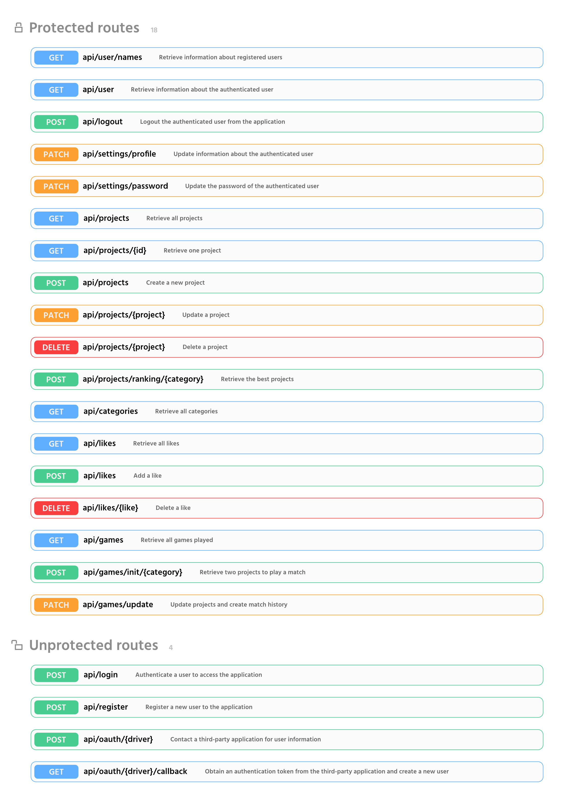

<br />
<p align="center">
  <a href="https://github.com/N0Ls/Wodabest-REST">
    
  </a>

  <h3 align="center">Wodabest</h3>

  <p align="center">
    A Tinder like Art Gallery !
    <br />
    <a href="https://wodabest.herokuapp.com">View online</a>
  </p>
</p>

<!-- TABLE OF CONTENTS -->
## Table of Contents

* [About the Project](#about-the-project)
  * [Built With](#built-with)
  * [Features](#features)
* [Architecture diagram](#architecture-diagram)
* [Getting Started](#getting-started)
* [Usage](#usage)
    * [Development](#development)
    * [Socialite](#socialite)
    * [API routes](#api-routes)
* [License](#license)
* [Contributors](#contributors)

<!-- ABOUT THE PROJECT -->
## About The Project

Wodabest is THE platform for sharing your artistic, creative and inventive works. More than just a gallery, Wodabest allows you to compare your most beautiful works through a system based on the ELO algorithm. Whether to inspire or challenge yourself, improve or prove your creative talent, don't waste any more time and join the Wodabest community.

Looking for inspiration? Curious? Take a tour of the art gallery to appreciate the wonderful work recently added. A preference ? Activate the filters!

Wondering how your works are doing in the midst of this fierce competition? Take a look at the leaderboard to see if your works have reached the heights!

Have you just finished your last creation? Don't wait any longer and bring it into the competition.

### Built With

Wodabest is built on a set of trendy technologies to provide you with an optimal user experience.
* [Laravel](https://laravel.com)
* [Vue](https://vuejs.org/)
* [Bootstrap](https://getbootstrap.com)

### Features

- REST API with Laravel 7 
- Vue + VueRouter + Vuex + VueI18n + ESlint
- Pages with dynamic import and custom layouts
- Authentication with JWT
- Socialite integration

## Architecture diagram

> The following diagram allows you to have an overview of the interactions inside the application.

<p align="center">

</p>

## Getting Started

To setting up the project locally and get a local copy up and running, follow the following steps.

1. Clone the repository
```sh
git clone https://github.com/N0Ls/Wodabest-REST.git
```
2. Create a .env file to set your connection details
```sh
cp .env.example .env
```
3. Install Laravel to process the required files in web browser
```sh
composer install
```
4. Generate Laravel application key
```sh
php artisan key:generate
```
5. Generate a JWT secret key (will be used to sign your tokens)
```sh
php artisan jwt:secret
```
6. Run migrations with seed option
```sh
php artisan migrate --seed
```
7. Install NPM packages
```sh
npm install
```

## Usage

### Development


Open a terminal and run the following command :
```bash
# build and watch
npm run watch

# serve with hot reloading
npm run hot
```

On another terminal, run :
```bash
php artisan serve
```

### Socialite

This project uses [Laravel Socialite](https://laravel.com/docs/5.8/socialite).

To enable the provider, create new GitHub and Google applications and use `https://example.com/api/oauth/github/callback` and `https://example.com/api/oauth/google/callback` as the Authorization callback URLs.

Edit `.env` and set `GITHUB_CLIENT_ID`, `GITHUB_CLIENT_SECRET`, `GOOGLE_CLIENT_ID`, `GOOGLE_CLIENT_SECRET` with the keys from your GitHub and Google applications.

### API routes

> All the active routes of Wodabest API.

<p align="center">

</p>

For more details, see the full documentation in `doc/api-documentation`.

## License

Distributed under the MIT License.

## Contributors

Nils LANDRODIE - Backend Developper - nilsland31@gmail.com

Mattéo POPOFF - Backend Developper - pmatteo98@gmail.com

Cloé QUIRIN - Frontend Developer - cloequirin3@gmail.com

Léa ROSTOKER - Webdesigner - lea.rostoker.12@gmail.com

Vincent SCAVINNER - Frontend Developer - vscavinner@gmail.com